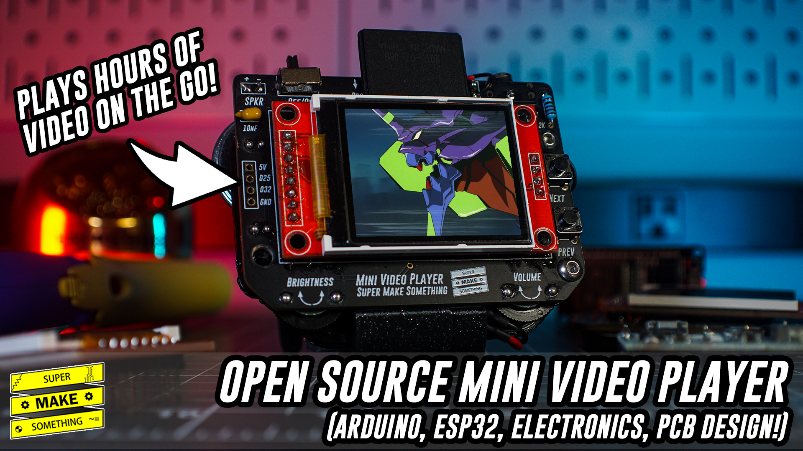
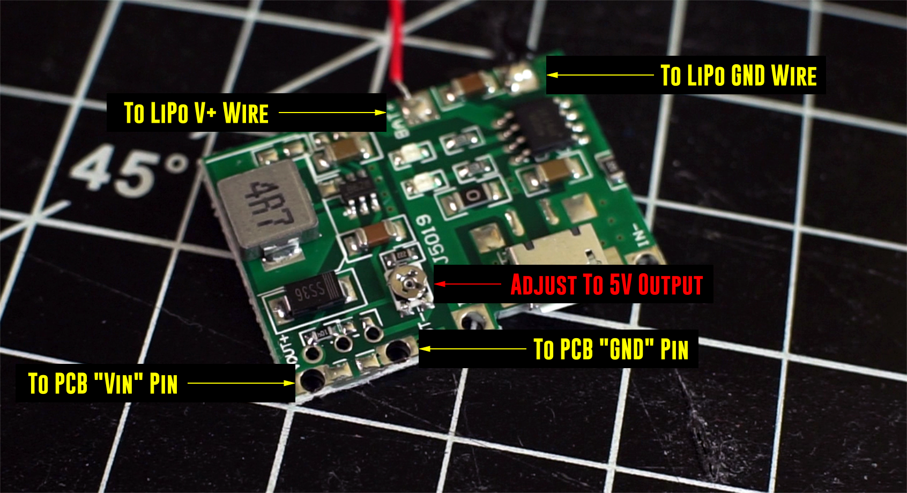

# Open Source Mini Video Player
by: Alex - Super Make Something

date: August 13, 2022

license: Creative Commons - Attribution - Non-Commercial.  More information available at: http://creativecommons.org/licenses/by-nc/3.0/

Arduino code and programming instructions for the Mini Video Player featured in Super Make Something Episode 24!

The project video can be found here: https://youtu.be/67RFm2RMjC4

We also built one LIVE on Youtube! Check out the replay of the livestream here: https://youtu.be/Ob_l5PkH2qA

If you like projects like these, consider subscribing to the Super Make Something YouTube page [here](https://www.youtube.com/supermakesomething?sub_confirmation=1) for more cool builds!  To support more projects you can [buy me a coffee on KoFi](https://ko-fi.com/supermakesomething).

## Introduction
This repository contains code and additional instructions to build your own Mini Video Player.  Information found in this repository accompanies the "Open Source Mini Video Player" build video on the Super Make Something YouTube page, which can be found here: https://youtu.be/67RFm2RMjC4

Please watch the accompanying project video and read through this README file in its entirety before beginning assembly of your PCB. For the 'Over 9000' configuration, the potentiometer of the battery charger and boost module must be adjusted so that it has a 5V output voltage in order to not damage the ESP32.

## Installation instructions and required libraries
The `Code` folder contains all of the files needed to compile the project.  The folder `miniVideoVideoPlayer` contains the miniVideoPlayer.ino file, which should be opened in the Arduino IDE.  Folders in the `libraries` directory should be copied to the location of where your other Arduino libraries are installed.  For Windows users, this is typically under `Documents\Arduino\libraries`.

*Note:* Instructions on how to install the ESP32 library so that it can be programmed using the Arduino IDE can be found [here](https://youtube.com/shorts/HyL55EKHbtg).  At the time of this writing, the code for this project only works with the `esp32` library up to version 1.0.6.

## Bill of materials
The following quantities and components are needed to build this project.  You can also buy a kit version that includes everything you need here: LINK COMING SOON!

- PCBs: https://bit.ly/3A1mmZc
- 1x ESP Wroom 32 Development Kit (30 pin version): https://amzn.to/3zT9VOL
- 1x PAM8403 Audio Amplifier: https://amzn.to/3AmsVa8
- 2x Thumbwheel Potentiometers: https://amzn.to/3dtOYCq
- 1x PCB Headphone Socket: https://amzn.to/3QgI2at
- 1x 2W 8 Ohm Speaker: https://amzn.to/3QlU2aT
- 1x ST7735 LCD with SD Card Slot: https://amzn.to/3bQvFmG
- 2x Momentary Push Buttons: https://amzn.to/3QKNdiz
- 1x 2.2k Resistor: https://amzn.to/3w2nN8x
- 1x SPDT 3 Terminal Slide Switch: https://amzn.to/3w6l1Pp
- 1x 10uF Capacitor: https://amzn.to/3PgUTYU
- 1x 16GB SD Card: https://amzn.to/3dqpxSo
- 1x Lipo Charger + Boost Module: https://amzn.to/3JSrEuo
- 1x 820mAh Lipo Battery: https://amzn.to/3SQjyqk
- 3x M3 Button Head Screws: https://amzn.to/3C4wIdm
 
I used the following tools during the build. If you need any of these, they can be found here:
- Hakko FX888D Digital Soldering Station: https://amzn.to/3JRXAim
- Digital Multimeter: https://amzn.to/3w6lWiP
- Desoldering Wick: https://amzn.to/3C0L1zy
- Desoldering Pump: https://amzn.to/3AkJWBt
- Tin Lead Rosin Core Solder: https://amzn.to/3SQJj9K
- Elegoo Neptune 3 3D Printer: https://amzn.to/3bWweeI

(All Amazon links are affiliate links.)

## PCB Design Files

The PCBs for this project were designed with Altium Designer.  You can get a free trial of Altium Designer [here](https://www.altium.com/yt/supermakesomething) and also get 25% off through this link if you decide to buy a license.  I'm still working out how best to share the design files, but in the meantime feel free to grab the PCB Gerber files from PCBWay here: https://bit.ly/3A1mmZc

## Other Notes

The wiring diagram for the battery charger and boost module can be found in the figure above.  Please use a multimeter and adjust the potentiometer on this module to ensure sure that the output voltage that is connected to the ESP32 is 5V.  Higher voltage may damage your ESP32 or other components.

## Conclusion
Hopefully you found this project useful!  If you enjoyed this tutorial, consider subscribing to Super Make Something on YouTube [here](https://www.youtube.com/supermakesomething?sub_confirmation=1) for more cool builds!  If you _really_ liked this tutorial and want to support future projects, you can [buy me a coffee on KoFi](https://ko-fi.com/supermakesomething).

If you have any questions or comments, I can most easily be reached on [Twitter](https://twitter.com/supermakesmthng) or [Instagram](https://www.instagram.com/supermakesomething/).  For items or issues specifically related to this project, please leaving your questions in the comments of the accompanying YouTube video so that they can be referenced by others during their own builds.

